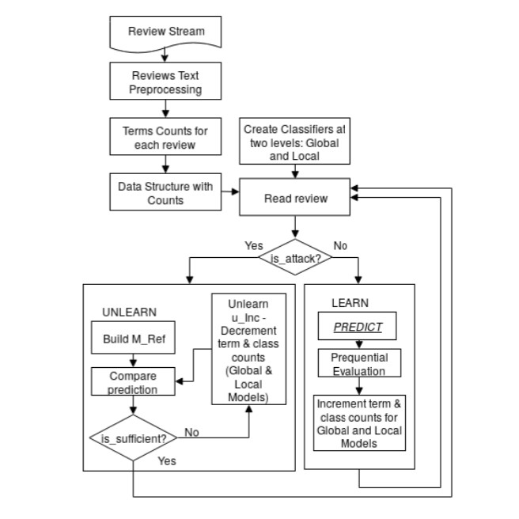
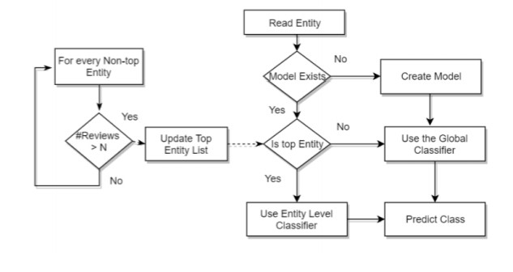

# Machine Unlearning

With an increasing proportion of shopping done online, customers are ever more dependent on each others’ experiences to gather information on a product. As more people move online for shopping, the problem of deceptive reviews online is only likely to exacerbate. We propose a method that unlearn the impact of deceptive reviews while taking into account that such an attack might affect only specific entities and be invisible at the global level. Entity centric modeling allows the model to isolate the impact of deceptive spam reviews, and the unlearning is accomplished through incrementally removing the impact of those data points deemed most suspicious through modifying the conditional counts of a multinomial Naive Bayes classifier. Evaluation
is performed on the Amazon reviews dataset, where the review stream is modified to simulate an attack. Our results indicate that incremental unlearning of suspicious reviews are able to reverse the adverse impact of deceptive spam on the model under uncertainty regarding review veracity.

